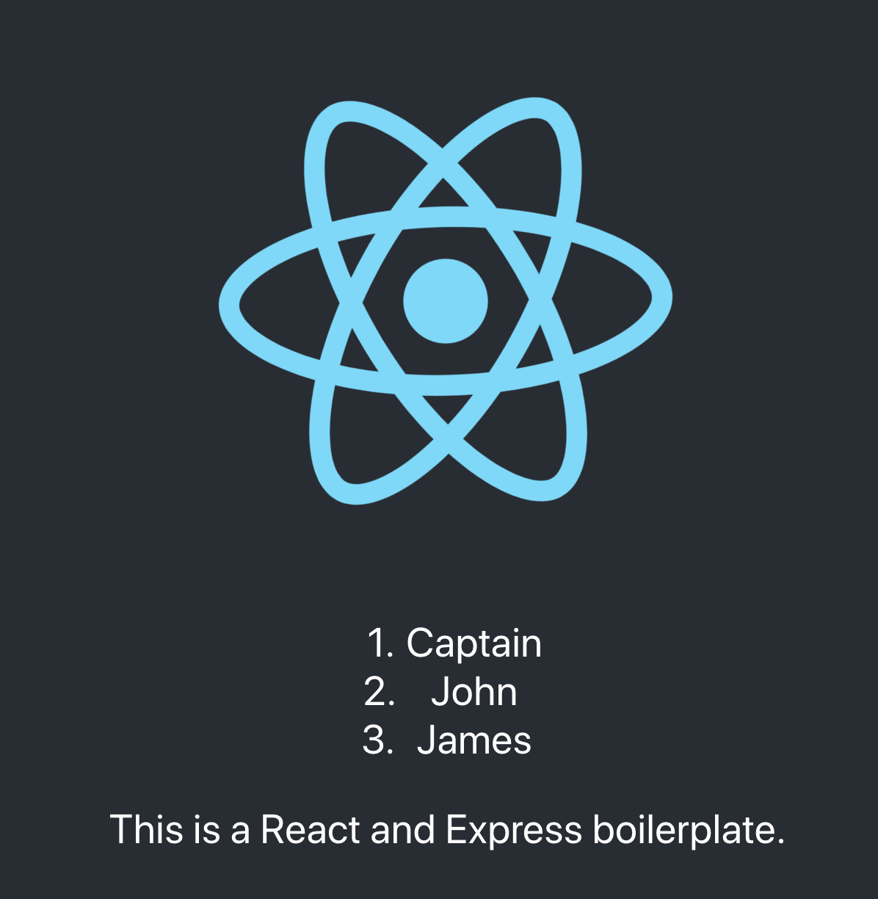

# How to create a React and Express boilerplate?

## `Section 1: Set up back-end.`

### `Step1: Create a new folder`

```bash
$ mkdir ReactAndExpress
$ cd ReactAndExpress
```

### `Step2: npm init`

```bash
$ npm init
```

`note:`

- The entry point is `server.js`

### `Step3: install packages`

```bash
$ npm install express
$ npm install concurrently
$ npm install nodemon --save-dev
$ npm install morgan
```

`note:`

- If you get some issues about 'permisson denied...', try this
- mac

```bash
$ sudo npm cache clean -f
```

### `Step4: Add two scripts in package.json, start:(...), server:(...)`

- Your package.json file should look like this so far.

```js
{
  "name": "reactandexpress",
  "version": "1.0.0",
  "description": "This is a React-Express boilerplate.",
  "main": "server.js",
  "scripts": {
    "start": "node server.js",
    "server": "nodemon server.js"
  },
  "author": "Donghao Wu",
  "license": "MIT",
  "dependencies": {
    "concurrently": "^4.1.1",
    "express": "^4.17.1",
    "morgan": "^1.9.1"
  },
  "devDependencies": {
    "nodemon": "^1.19.1"
  }
}
```

### `Step5: Create a new file call 'server.js', set up your server inside that file`

```js
//Create a server
const express = require("express");
const app = express();

//Middleware here
app.use(express.json());
app.use(express.urlencoded({ extened: true }));
const morgan = require("morgan");
app.use(morgan("dev"));

/*
other codes
*/

//Set up Server Port
const port = 4000;
const server = app.listen(port, () => {
  console.log(
    `Port ${port} is listening =======================================>`
  );
});
```

`note:`

- In this case, you can set the port any number except front-end port(3000), and you should remember your port then use it in proxy.

## `Section 2: Set up front-end.`

### `Step6: Create frontend folder in the directory`

`Location: folder ReactAndExpress`

```bash
$ npx create-react-app client
```

`note:`

- In this case, you can set the any folder name, but we usually call it 'client'.

## `Section 3: Connect the Front-end(port:3000) and Back-End(port:4000).`

- So that we can browse in the localhost:3000, and fetch data in localhost:4000`

### `Step7: Define our backend port as a proxy`

`Location: ./client/package.json`

```js
"proxy": "http://localhost:4000"
```

`note:`

- Add this line in package.json, the port here(4000) should match the port set up in step5.

## `Section 4: Test the server.`

### `Step8:`

<ol>
<li>Edit /client/src/App.js</li>
<li>Create /client/src/Students.js</li>
<li>Edit /server.js</li>
</ol>

`Location: ./client/src/App.js`

```js
import React from "react";
import logo from "./logo.svg";
import "./App.css";
import Students from "./Students.js";

function App() {
  return (
    <div className="App">
      <header className="App-header">
        
        <Students />
        This is a React and Express boilerplate.
      </header>
    </div>
  );
}

export default App;
```

`Location: ./client/src/Students.js`

```js
import React, { Component } from "react";

class Students extends Component {
  constructor() {
    super();
    this.state = {
      students: [],
      isLoaded: false
    };
  }

  async componentDidMount() {
    try {
      const res = await fetch(`/api/students`);
      const data = await res.json();
      this.setState({
        students: data,
        isLoaded: true
      });
    } catch (e) {
      console.log(e);
    }
  }

  render() {
    return this.state.isLoaded ? (
      <ol>
        {this.state.students.map((el, index) => {
          return <li key={index}>{el.firstName}</li>;
        })}
      </ol>
    ) : (
      <div>Loading...</div>
    );
  }
}

export default Students;
```

`Location: ./server.js`

```js
//Create a server
const express = require("express");
const app = express();

// Set up Middlewares
app.use(express.json());
app.use(express.urlencoded({ extened: true }));
const morgan = require("morgan");
app.use(morgan("dev"));

//Add dummy data to test the server.
app.get("/api/students", (req, res) => {
  const students = [
    { id: 1, firstName: "Captain", lastName: "fancy" },
    { id: 2, firstName: "John", lastName: "Jordan" },
    { id: 3, firstName: "James", lastName: "Harden" }
  ];
  res.json(students);
  //res.send(students);
});

//Set up Server Port
const port = 4000;
const server = app.listen(port, () => {
  console.log(
    `Port ${port} is listening =======================================>`
  );
});
```

- Open two terminals, one in ReactAndExpress directory

```bash
$ npm run server
```

- Another one in client directory

```bash
$ npm start
```

`note:`

- `If you open your browser in localhost:3000, and see this, that means everything works well.` 

### `Step9: Make your life easier`

- Add two scripts in ./server.js, so that we don't have to open two terminals.

`Location: ./package.json, your scripts part should look like this.`

```js
"scripts": {
  "start": "node server.js",
  "server": "nodemon server.js",
  "client": "cd client && npm start",
  "dev": "concurrently \"npm run server\" \"npm run client\""
}
```

`Now you can run this command in one terminal`

```bash
$ npm run dev
```

### `Something you may want to know before pushing this repo to Github`

`About .gitignore`

<ol>
<li>Copy the .gitignore in folder client(so you have two now).</li>
<li>Change `/node_modules` to `node_modules/`</li>
<li>After this, we will not put any node_modules file to Github(because we have two in this project, one in main folder, one in client folder.)</li>
<li>But you have to install twice after we pull the repo.</li>
</ol>

`Maybe you cannot open the client folder in Github.`

<ol>
<li>To solve this, before you push, remove all initialization of git init, in this case, run these commands in bash.</li>
</ol>

- mac

```bash
$ cd client
$ rm -rf .git
$ cd ..
$ rm -rf .git
$ git init
...
```

- windows at root directory

```bash
$ rm .git
$ git init
...
```
