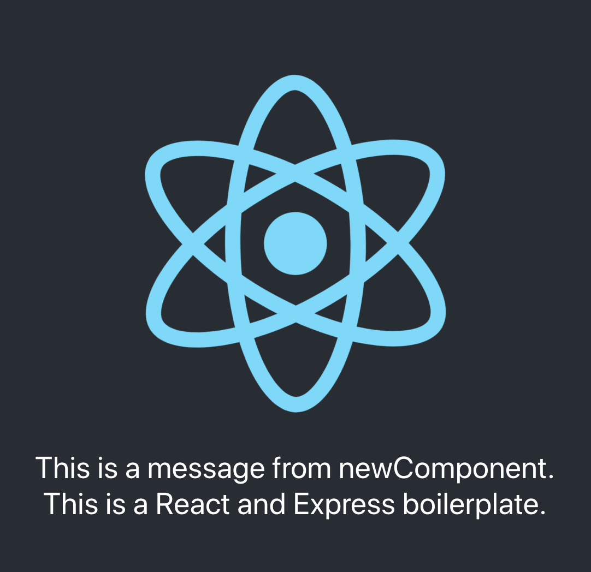

### `This app is an React boilerplate ready for adding new route.`

## Available Scripts

### After you pull the repo, run this command in terminal.

```bash
$ npm install
```

In the client folder, you can run:

#### `npm start`

Open [http://localhost:3000](http://localhost:3000) to view it in the browser.

#### `control + c`

Quit the development mode.

### `Dependencies`

- react
- react-dom
- react-scripts
- react-router-dom

### 1. How to add a new component.

#### `Step 1: Create a new file in Components folder, for example, name it 'newComponent.js'`

`Location: ./client/src/Components/newComponent.js`

```javaScript
import React, { Component } from "react";

class newComponent extends Component {
  constructor() {
    super();
    this.state = {};
  }

  render() {
    return(
      <div>This is a message from newComponent.</div>
    )
}

export default newComponent;
```

#### `Step 2: Import the newComponent in index.js inside of components folder.`

`Location: ./client/src/Components/index.js`

```js
export { default as newComponent } from "./newComponent.js";
```

#### `Step 3: Import the new component in switchboard component (Routes.js).`

`Location: ./client/src/Routes.js`

```js
import React, { Component } from "react";
import { Route, Switch } from "react-router-dom";
import { Example, newComponent } from "./Components";

class Routes extends Component {
  constructor() {
    super();
    this.state = {};
  }

  render() {
    return (
      <Switch>
        /* Add your front-end route here */
        <Route exact path="/newComponent" component={newComponent} />;
        <Route component={Example} />;
      </Switch>
    );
  }
}

export default Routes;
```

#### `Step 4: Test`

`Location: url: localhost:3000/newComponent`

If you can see this, that means you new component is working.

