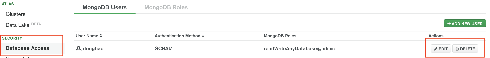
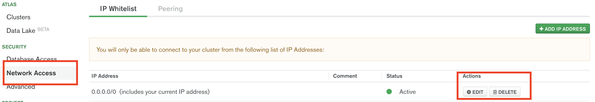
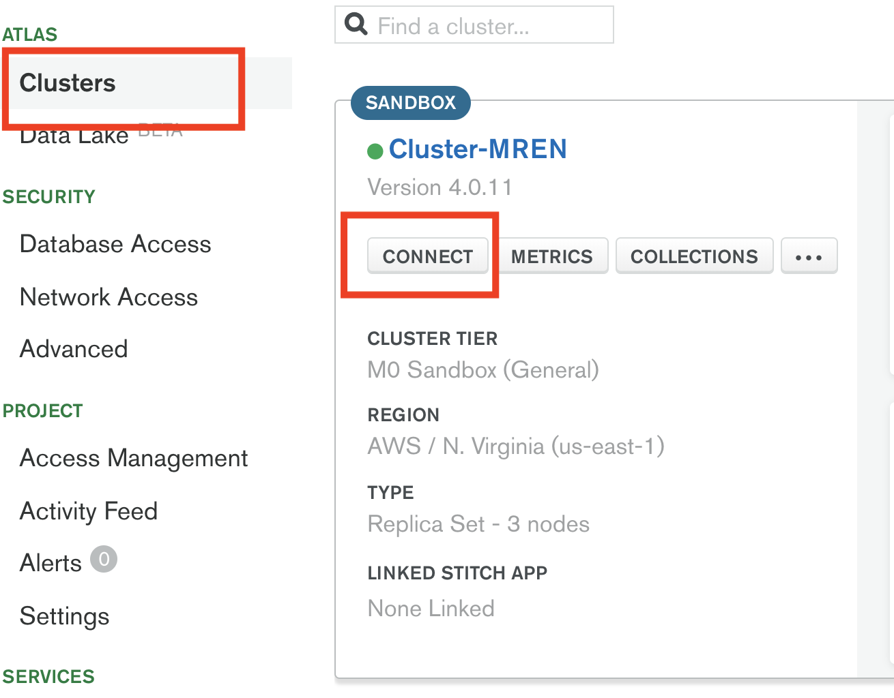
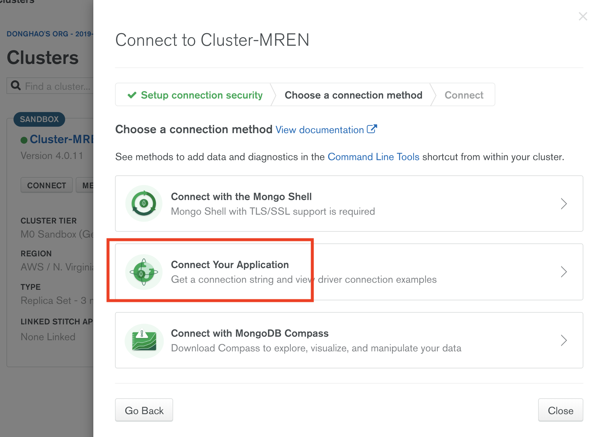
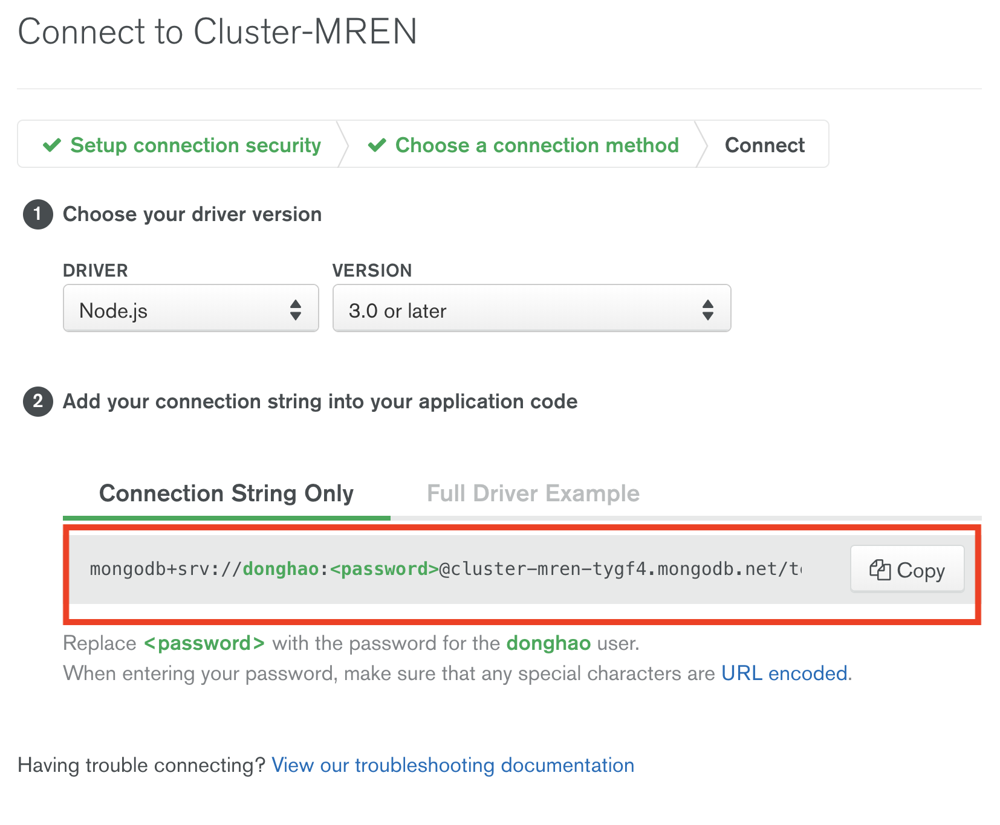
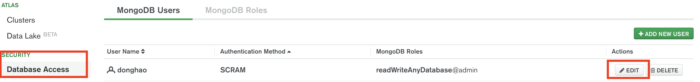
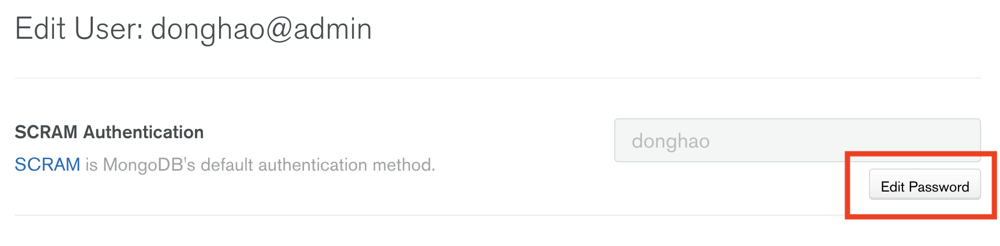
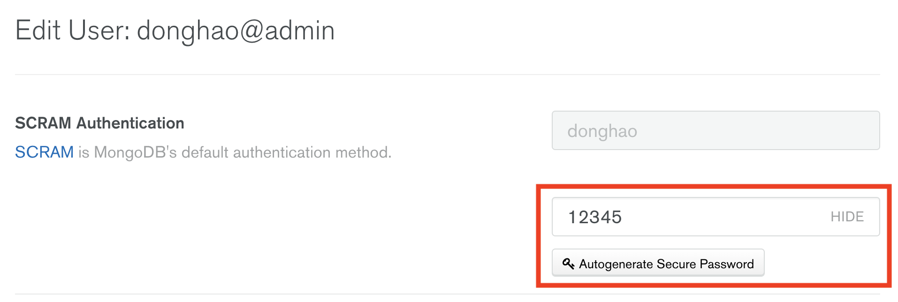
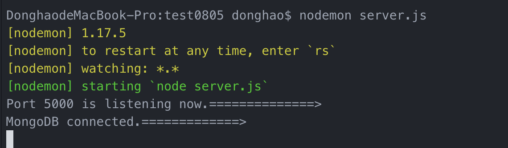

# MERN-Stack-Level1-CreateDemo

## `Section 1: How to set up MongoDB Altas.`

### `Check Dependencies`

- express
- morgan
- nodemon
- mongoose

### `Step1: Altas set up`

<ol>
<li> Sign in</li>
<li> Build a new Cluster</li>
<li> Set up DataBase access</li>

<p align="center">

</p>

<li> Set up Network access</li>

<p align="center">

</p>

<li> Click on Clusters</li>
<li> Click on connect</li>

<p align="center">

</p>

<li> Click on Connect to your application</li>

<p align="center">

</p>

<li> Copy your connection string</li>
<p align="center">

</p>

</ol>

### `Step2: Set up your Mongo String`

#### `Now, you can get a connection string like this`

```js
mongodb+srv://donghao:<password>@cluster-mren-tygf4.mongodb.net/test?retryWrites=true&w=majority
```

#### `Replace the <password> with the user password from MongoDB Altas, you can find it here`

- picture 1

  <p align="center">
  
  </p>

- picture 2 or you can edit and update your password here.

  <p align="center">
  
  </p>

- picture 3

<p align="center">

</p>

### `Step3: Time to code`

#### - `Install mongoose dependency`

```bash
$ npm install mongoose --save
```

#### - `DB set up.`

`location: server.js`

```js
//Add your DB here.
const mongoose = require('mongoose');

//Your connection string from step2.
const db =
  'mongodb+srv://donghao:<password>@cluster-mren-tygf4.mongodb.net/test?retryWrites=true&w=majority';

const connectDB = async () => {
  try {
    await mongoose.connect(db, {
      useNewUrlParser: true
    });

    console.log('MongoDB connected.=============>');
  } catch (err) {
    console.error(err.message);
    //Eit process with failure
    process.exit(1);
  }
};

connectDB();
```

#### - `Express server set up.`

`Install dependency`

```bash
$ npm install --save express
$ npm install --save nodemon
$ npm install --save morgan
```

`Add code, location: server.js`

```js
const express = require('express');
const mongoose = require('mongoose');
const morgan = require(`morgan`);
const port = 5000;
const app = express();

//Middleware here!
app.use(express.json());
app.use(express.urlencoded({ extended: true }));
app.use(morgan('dev'));

/*
DB here!
*/

/*
Routes here!
*/

const server = app.listen(port, () => {
  console.log(`Port ${port} is listening now.==============>`);
});
```

#### `Finally, server.js should look like this:`

```js
const express = require('express');
const mongoose = require('mongoose');
const morgan = require(`morgan`);
const port = 5000;
const app = express();

//Middleware here!
app.use(express.json());
app.use(express.urlencoded({ extended: true }));
app.use(morgan('dev'));

//DB here!
const db =
  'mongodb+srv://donghao:<password>@cluster-mren-tygf4.mongodb.net/test?retryWrites=true&w=majority';

const connectDB = async () => {
  try {
    await mongoose.connect(db, {
      useNewUrlParser: true
    });

    console.log('MongoDB connected.=============>');
  } catch (err) {
    console.error(err.message);
    //Exit process with failure
    process.exit(1);
  }
};
//Invoke the function and connect to MongoDB Altas.
connectDB();

/*
Routes here!
*/

const server = app.listen(port, () => {
  console.log(`Port ${port} is listening now.==============>`);
});
```

`Note:`

- Before test, you should change the mongoDB connection String and password to your own.

### `Step4: Test and run`
`Location:root directory`

```bash
$ nodemon server.js
```

- If you get this, it means everything works well.

<p align="center">

</p>